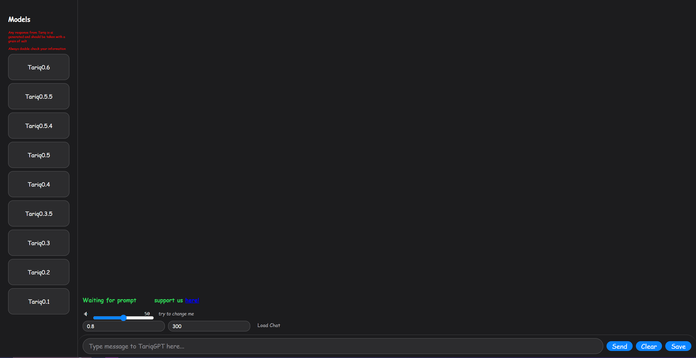

# TariqGPT
This is a step by step guide that will allow you to:
run tariq on localhost
talk to all publicly of tariqgpts models (currently all are public except the tariq's that spit garbled messes)
save chats
and most importantly goof off with the **from scratch** AI TariqGPT who was created with a labor of love from me and a friend (@poopypants)

# Prerequisites:
1. npm package manager or other package manager that node supports
2. python 3.12
3. a browser of your choice that can access local host
4. unzip -> /src/interpreter/models/models.zip
# Steps for Windows
1. Go to root directory and run `npm install`
2. If any errors are present, run `npm audit fix`
3. Make sure the dev server works by running `npm run dev` <- this should run the local host, 
4. Make sure the port is on **5173** <- if it isn't this port, then it WILL NOT allow api to run go to step 10. 
5. You can choose to close the dev server once you have it working
6. Now go to src/interpreter, and run `py -3.12 -m pip install -r requirements.txt`.
7. Run `py -3.12 server.py`, it should run a localhost which will serve as an api for the vite server. output will look like this:
   ```bash
	INFO:     Started server process [25044]
	INFO:     Waiting for application startup.
	INFO:     Application startup complete.
	INFO:     Uvicorn running on http://0.0.0.0:8000 (Press CTRL+C to quit)
   ```
   When requests come through, you will see status and the request made.
8. Make sure to test run run `py -3.12 model_interpreter.py 50 0.7 Tariq0.3 "Hello Tariq"`, then terminate the process with `CTRL+C`, you just need it to run without showing errors.
   Example output for 0.6:
   ```bash
   Using model: Tariq0.6 (E:\TairiqGPT testing\TariqGPT\src\interpreter\models\Tariq0.6.pt)
	Using device: cuda
	[interpreter] Checkpoint keys: ['model_state_dict', 'optimizer_state_dict', 'config', 'vocab', 'epoch', 'step', 'loss', 'sft', 'sft_version', 'tokenizer_c2i']
	[interpreter] Config ('config'): {'name': 'Tariq0.6', 'embed_dim': 320, 'n_heads': 10, 'n_layers': 18, 'block_size': 256, 'dropout': 0.0}
	[interpreter] Missing keys (18): ['blocks.0.attn.mask', 'blocks.1.attn.mask', 'blocks.2.attn.mask', 'blocks.3.attn.mask', 'blocks.4.attn.mask', 'blocks.5.attn.mask', 'blocks.6.attn.mask', 'blocks.7.attn.mask', 'blocks.8.attn.mask', 'blocks.9.attn.mask']
	[interpreter] OK — Tariq0.6  params=23.31M  vocab=3319

   ```
   do not expect an output, since the output for tariq gets put in the buffer.
9. Once you've confirmed everything is working, and that your vite server is on **1573** and your server.py is running on port **8000**, you should see the following:
   
   You may send and save messages as well as run them, and it will all run locally! have fun testing with TariqGPT!
10. Go to root, and run `npx vite --port 5173`